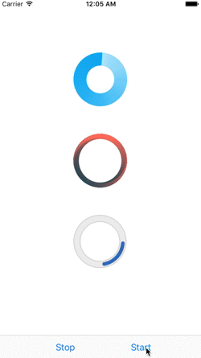
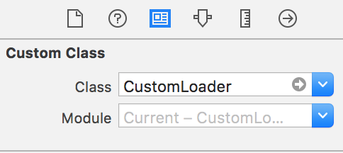
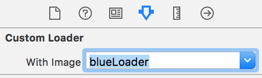

# Custom Loader

[](http://cocoapods.org/pods/LFAlertController)
[![Swift Version][swift-image]][swift-url]

Transform your own png loader into real animated loader



## Initialization

- import the file "CustomLayer.swift" into your project
- import your loader png into Assets.xcassets as usual
- define it within storyboard or programatically :


#### Within Storyboard :

- create a UIView as usually
- specify its class to CustomLoader as below :



- choose its png image in the Attributes Inspector :




#### or Programmatically :

```  swift-3
let myLoader = CustomLoader(withImageNamed: "blueLoader", inRect: CGRect(x: 50, y: 50, width: 100, height: 100))
view.addSubview(myLoader)
```

## Usage

Call ```startAnimation()```
 to play it, and ```stopAnimation()``` to stop it.
However, CustomLoader inherits from UIView, every attributes and methods from UIView are usable.

[swift-image]:https://img.shields.io/badge/swift-3.0-orange.svg
[swift-url]: https://swift.org/
